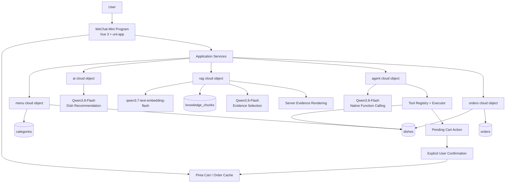

# 基于 LLM + RAG + Function Calling 的微信智能点餐 Agent

**LLM-powered WeChat Ordering Agent with RAG and Function Calling**

一个基于 Vue 3、uni-app、Pinia 与 uniCloud 的微信点餐项目。它同时实现了 Qwen 菜品推荐、Evidence-first RAG 菜单问答、多步 Function Calling Agent，以及带服务端校价、显式确认和幂等保护的真实订单闭环。

RAG 与 Ordering Agent 是两项独立能力：RAG 负责菜单知识问答，Agent 负责实时菜单 Tool 编排和购物车动作提案；当前没有把 `rag.answer()` 注册成 Agent Tool。

## 核心亮点

1. **Evidence-grounded RAG**：模型只选择可信 evidence ID，服务器验证后直接使用知识原文渲染答案，避免模型自由改写事实。
2. **Multi-step Function Calling Agent**：Qwen 能观察第一次 Tool Result，再决定第二次 Tool Call；“可乐无结果后查询在售饮料”不是程序硬编码 fallback。
3. **Human-in-the-loop Side Effects**：LLM 只能生成经过服务端校验的 Pending Action，用户明确确认并再次复核实时菜单后，才修改 Pinia Cart。
4. **Deterministic Transaction Boundary**：订单预览、实时计价、确认值比较和持久化全部由普通服务端逻辑执行，不交给 Qwen。
5. **Idempotent Order Creation**：`requestId + canonical fingerprint + UNIQUE sparse index` 为同一订单意图提供服务端重放语义。

## Demo / Screenshots

仓库不包含伪造截图。建议按 [Demo Guide](docs/DEMO_GUIDE.md) 从真实微信开发者工具与 uniCloud 控制台截取：

| 场景 | 建议截图 |
| --- | --- |
| 首页能力入口 | AI 智能点餐、菜单问答、智能点餐 Agent |
| RAG 问答 | “有什么比较清爽的？”的 Grounded Answer 与依据 |
| Multi-step Agent | “有可乐吗？没有的话推荐点别的喝的。”的自然语言结果 |
| 安全加购 | 柠檬茶 ×2 Pending Action 与确认按钮 |
| 订单闭环 | ¥24 Preview、最终确认、真实 orderNo |
| 幂等落库 | orders 记录中 requestId 存在，敏感字段打码或裁剪 |

## System Architecture



图中的 RAG 与 Agent 没有直接连线，因为当前 Agent Loop 不会自动调用 RAG。完整组件、信任边界和数据流见 [Architecture](docs/ARCHITECTURE.md)。

## Core Features

### 基础业务

- 首页、菜单分类、菜品详情、购物车、确认订单、订单列表和个人页。
- Pinia 管理客户端购物车；categories、dishes、orders 使用 uniCloud 持久化。
- 后端读取实时菜品状态与价格，按订单快照保存历史名称、价格、数量和小计。
- 匿名 `clientId` 仅用于开发期数据隔离，不属于身份认证。

### LLM Recommendation

- Qwen3.8-Flash 理解预算、口味、辣度和食材排除条件。
- 模型只能选择当前数据库提供的真实 dishId。
- 服务端再次校验 dishId、`on_sale` 状态与数据库价格，并计算 `totalPrice`。
- 推荐结果可复用现有 Pinia 加购逻辑；模型不能直接创建订单。

## RAG Design

```text
21 verified knowledge chunks
 → qwen3.7-text-embedding-flash / 512 dimensions
 → knowledge_chunks idempotent indexing
 → Query Embedding
 → Exact Cosine Similarity
 → Top-3 Retrieval
 → Qwen evidence selection
 → Server ID validation
 → Server-rendered trusted evidence
```

Knowledge Source 与索引数据保持单向关系：

```text
docs/rag/knowledge-source.json         # 唯一人工维护源
 → rag/resources/knowledge-source.json # 部署副本
 → Embedding / Indexing
 → knowledge_chunks                    # 派生索引
```

价格、销量和在售状态不写入长期知识正文，继续从 dishes 实时读取。

### Evidence-first Grounding 的真实演进

最初让模型基于 Retrieval Evidence 自由生成答案，真实测试中出现了 evidence 没有提供的“解腻”，以及把“具有柠檬香气”扩写为“具有清爽的柠檬香气”。合法 knowledgeId 并不能保证自由文本中的每个 claim 都受支持。

最终合同收紧为模型只返回：

```json
{
  "answerable": true,
  "dishIds": ["dish-3"],
  "usedKnowledgeIds": ["dish-3-taste"]
}
```

服务器验证 ID、读取本次真实 evidence，并按原文生成最终答案。模型仍可能漏选或选择不合适的合法 evidence，但不能自行改写事实后直接展示给用户。

## Agent Design

Agent 使用 Qwen3.8-Flash 的原生 Function Calling，Registry 是唯一机器可读 Tool 合同，Executor 负责 allowlist、Schema 校验和静态实现映射。

当前 Tool：

- `search_menu`
- `list_available_drinks`
- `get_dish_detail`
- `prepare_add_to_cart`

真实多步案例：

```text
User: 有可乐吗？没有的话推荐点别的喝的。
 → Qwen calls search_menu({ query: "可乐" })
 → Tool Result: count = 0
 → Qwen observes the result and re-plans
 → Qwen calls list_available_drinks({})
 → Tool Result: 柠檬茶 / on_sale / ¥12
 → Final natural-language answer
```

第二次调用由模型根据第一次观察决定，不是 `if no cola then list drinks` 的程序分支。

## Safe Action Execution

```text
User: 把柠檬茶加两杯到购物车
 → search_menu
 → prepare_add_to_cart
 → Server revalidates dish / status / price
 → Pending Action: quantity=2, unitPrice=12, totalPrice=24
 → requiresConfirmation=true
 → User clicks 确认加入购物车
 → Frontend reloads live menu and revalidates
 → Pinia addDish(dish, 2)
```

模型不能调用任意 Store mutation。Tool 只生成 Proposal；真正副作用需要服务端事实校验和用户显式确认。

## Order Confirmation & Idempotency

```text
Pinia Cart
 → orders.previewOrder()
 → Fresh Server Validation / Pricing
 → Server-validated Order Proposal
 → Explicit Information Confirmation
 → Final Explicit Order Confirmation
 → Generate requestId once + Freeze Submission Payload
 → orders.createConfirmedOrder()
 → Fresh Validation / Pricing Again
 → Expected Preview Comparison
 → Canonical SHA-256 Fingerprint
 → Persisted Order under UNIQUE sparse request_id_unique
 → Server Success
 → Clear Cart
```

真实保护案例：用户确认柠檬茶 ×2、单价 ¥12、总价 ¥24 后，数据库价格临时变为 ¥13。最终创建返回 `ORDER_CONFIRMATION_STALE`，没有静默按 ¥26 创建订单。

UI 的 `submittingOrder` 只能防普通双击。对于“服务器已写入但响应丢失”，前端会保留 requestId 与冻结的 `clientId/items/expectedPreview/remark`，重试完全相同的 payload：

- 同 requestId + 同 payload：返回首次订单，不重复插入。
- 同 requestId + 不同 payload：返回 `ORDER_IDEMPOTENCY_CONFLICT`。
- 并发安全最终依赖数据库 UNIQUE 约束，而不是存在竞态的 check-then-insert。

## Evaluation

以下为真实云端评测结果，范围是 **21-chunk 小型知识库与 12-query 人工固定评测集**（6 supported、3 unsupported-domain、3 external-OOD），不是生产 Benchmark。

| Metric | Result |
| --- | --- |
| Answerability Accuracy | 91.67%（11/12） |
| Supported Answer Rate | 83.33%（5/6） |
| Unsupported-domain Rejection Rate | 100%（3/3） |
| External-OOD Rejection Rate | 100%（3/3） |
| Retrieval Hit Rate | 100%（6/6 supported） |
| Average Retrieval Recall@3 | ≈80.83% |
| Evidence Hit Rate | 83.33%（5/6 supported） |
| Server Grounding Pass Rate | 100%（12/12） |

唯一 Answerability 错误是 supported False Negative：正确酸梅汤知识已进入 Top-3，但模型仍拒答。这说明 Grounding 结构正确不等于证据选择、完整性和 Answerability 都正确。

Robustness 评测还发现 supported 与 unsupported 的相似度分布发生重叠，因此没有用简单固定 similarity threshold 作为唯一拒答机制。

## Tech Stack

| Layer | Technology |
| --- | --- |
| Client | Vue 3、Composition API、uni-app、Pinia、微信小程序 |
| Backend | uniCloud 阿里云、云对象、云函数、云数据库 |
| Models | Qwen3.8-Flash、qwen3.7-text-embedding-flash |
| Protocol | OpenAI-compatible Chat Completions / Embeddings、Native Function Calling |
| Retrieval | 512-dimensional Embedding、Exact Cosine Similarity、Top-3 |
| Validation | JSON Schema、Tool allowlist、服务端事实校验、整数分计价 |
| Testing | Node.js built-in test runner、冻结 fixture、构建与知识副本检查 |

## Project Structure

```text
src/
 ├─ pages/                  # 业务、推荐、RAG、Agent 页面
 ├─ services/               # menu / orders / ai / rag / agent
 └─ stores/                 # Pinia Cart 与订单查询缓存

uniCloud-aliyun/
 ├─ cloudfunctions/
 │   ├─ menu / orders / ai / rag / agent
 │   └─ *-admin             # 仅开发验收入口
 └─ database/               # categories / dishes / knowledge_chunks / orders

docs/
 ├─ rag/                    # Knowledge、Indexing、Retrieval、Grounding、Evaluation
 ├─ agent/                  # Tools、Loop、Actions、Confirmation、Orders
 ├─ ARCHITECTURE.md
 ├─ DEMO_GUIDE.md
 ├─ FINAL_SUMMARY.md
 ├─ RESUME_NOTES.md
 └─ INTERVIEW_NOTES.md
```

## Run / Setup

准备 Node.js 20+、pnpm、HBuilderX 与微信开发者工具：

```sh
pnpm install
pnpm run rag:check-source
pnpm run build:mp-weixin
```

构建产物位于 `dist/build/mp-weixin`。CLI 构建不会部署云对象、初始化数据库或调用远程模型。

新环境还需要：

1. 在 HBuilderX 登录 DCloud，并关联阿里云 uniCloud 服务空间。
2. 初始化 categories、dishes、orders、knowledge_chunks schema/index。
3. 部署 menu、orders、ai、rag、agent 云对象。
4. 为对应云对象配置远程环境变量。
5. 在 HBuilderX 运行到微信开发者工具，并保持连接云端云函数。

详细步骤见 [uniCloud Setup](docs/UNICLOUD_SETUP.md)、[RAG Indexing](docs/rag/INDEXING.md)、[Agent Loop](docs/agent/AGENT_LOOP.md) 与 [Order Idempotency](docs/agent/ORDER_IDEMPOTENCY.md)。

## Environment Variables

| Cloud Object | Variables |
| --- | --- |
| ai | `DASHSCOPE_API_KEY`、`LLM_BASE_URL`、`LLM_MODEL` |
| rag | `DASHSCOPE_API_KEY`、`LLM_BASE_URL`、`EMBEDDING_MODEL`、`EMBEDDING_DIMENSION`、`RAG_LLM_MODEL` |
| agent | `DASHSCOPE_API_KEY`、`LLM_BASE_URL`、`AGENT_LLM_MODEL` |

真实 API Key 只配置在远程环境，不写入源码、日志或 Git。`.env`、`.hbuilderx/`、服务空间绑定文件和云函数 `*.param.json` 均由 Git 忽略。

## Testing

```sh
node --test tests/*.test.cjs
pnpm run build:mp-weixin
pnpm run rag:check-source
git diff --check
```

项目冻结时：**747 automated tests passed**。测试覆盖 RAG 索引/检索/生成/评测、Agent Tool 与多步循环、动作确认、订单预览/创建、幂等并发语义、前端状态以及冻结文件未漂移。

## Known Limitations / Future Work

- Knowledge Base 只有21条人工审核 chunks；12-query baseline 是项目级小样本评测。
- RAG 是单轮问答；Agent 没有多轮 conversation memory。
- RAG 没有注册成 Agent Tool，两项能力保持独立。
- 购物车仍在客户端 Pinia；Pending Action 不持久化。
- 未决 requestId 与 frozen payload 不跨页面刷新或小程序重启恢复。
- 没有微信登录、支付、库存事务或 exactly-once distributed transaction。
- 当前使用 Exact Search，没有 production-scale Vector DB、ANN 或分布式检索系统。
- clientId 只是开发期匿名隔离，不是正式认证。

这些是当前作品集范围。后续应先扩大人工评测与失败分析，再比较 reranker、hybrid retrieval、多轮状态和持久化提交恢复；支付与库存需要独立的交易设计。

## Evolution / Milestones

```text
Local Ordering
 → uniCloud Persistence
 → Qwen Recommendation
 → Verified Knowledge Source
 → Embedding / Idempotent Indexing
 → Retrieval / Robustness Evaluation
 → Evidence-first Grounded Answer
 → WeChat RAG UI
 → Tool Foundation
 → Multi-step Ordering Agent
 → Cart Proposal / Explicit Execution
 → Server Order Preview / Checkout Proposal
 → Persisted Confirmed Order
 → Server Idempotency
 → Frontend Same-key Retry Integration
```

完整冻结状态与真实 commit 里程碑见 [Final Summary](docs/FINAL_SUMMARY.md)。

## Interview Highlights

- 为什么合法 citation ID 仍不能保证 claim 语义受支持？
- 为什么相似度分数重叠后没有直接加 threshold？
- 为什么 Agent 算多步，但没有把 RAG 硬绑成 Tool？
- 为什么 LLM 只能生成 Proposal，不能直接修改 Cart？
- 为什么订单 Preview 后还要在 Create 阶段再次校价？
- 为什么数据库 UNIQUE index 比 check-then-insert 更可靠？

可直接用于求职的材料见 [Resume Notes](docs/RESUME_NOTES.md)、[Interview Notes](docs/INTERVIEW_NOTES.md) 和 [Demo Guide](docs/DEMO_GUIDE.md)。
