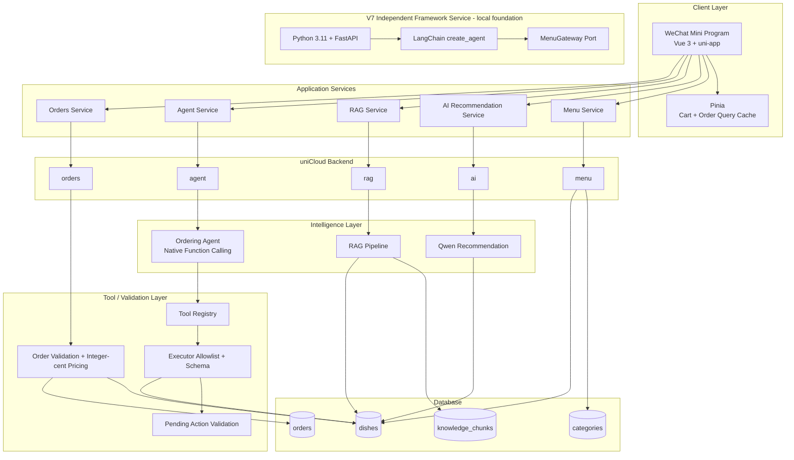
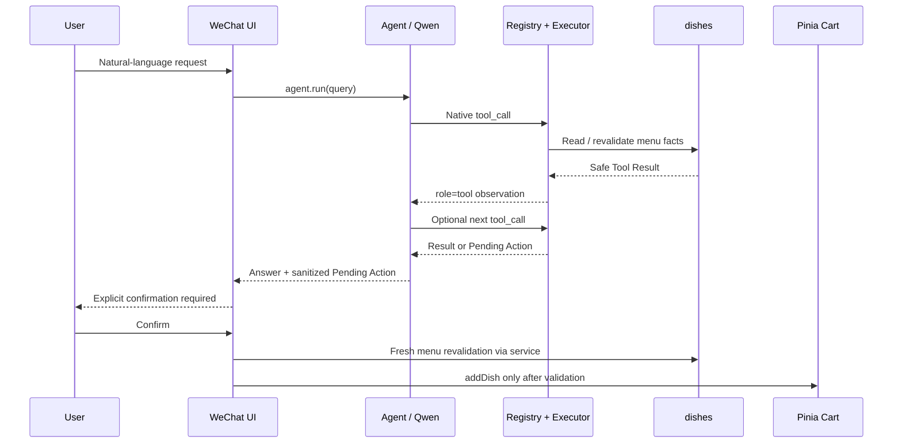
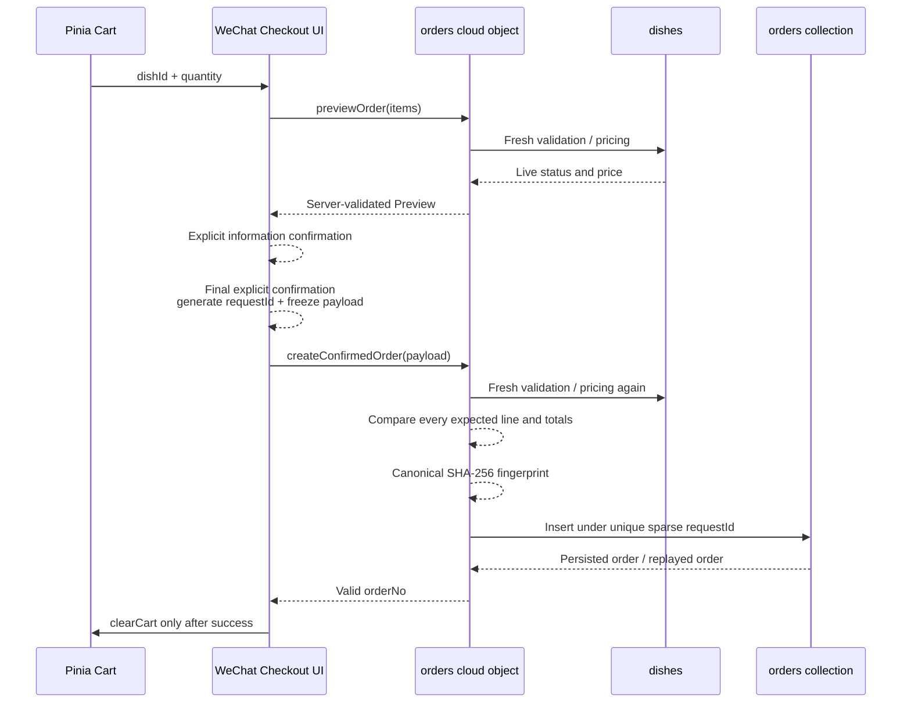

# 系统架构

## 1. 项目定位

这是一个基于 Vue 3、uni-app、Pinia 与 uniCloud 的微信智能点餐项目，包含三条相互独立但共享真实菜单事实的智能能力：

- Qwen 菜品推荐：自然语言偏好 → 真实菜品白名单。
- RAG 菜单问答：知识检索 → evidence 选择 → 服务器原文渲染。
- Ordering Agent：原生 Function Calling → 菜单 Tool → 待确认购物车动作。

RAG 与 Agent 当前没有互相调用；`rag.answer()` 没有注册为 Agent Tool。购物车和订单副作用也不由 LLM 直接执行。

V7.1A 在现有系统旁新增独立的 Python FastAPI + LangChain 本地框架服务。它通过
`MenuGateway` 端口预留未来只读接入，当前只使用测试 fixture 完成离线编排验证。它尚未
连接真实 uniCloud、Qwen 或微信端，不拥有数据库或交易职责，也没有显式自定义 LangGraph
流程。

## 2. 分层架构



未来接入方向留到 V7.1B：Python 服务将通过经过认证的只读网关访问现有业务核心；当前
架构图不把它连接到数据库，以免误示已经完成真实集成。

### Client Layer

- 页面只展示经过 service 清洗的数据。
- Pinia Cart 是客户端购物车状态；订单 Store 只缓存云端查询结果。
- 首页提供 AI 推荐、菜单问答与 Ordering Agent 三个独立入口。
- TabBar 保持首页、菜单、购物车、订单、我的五项。

### Application Services

`src/services/` 集中处理云对象调用、输入校验、响应白名单和友好错误：

- `menu.js`：分类与菜品。
- `ai.js`：自然语言菜品推荐。
- `rag.js`：正式单轮 `rag.answer(query)`。
- `agent.js`：正式 `agent.run(query)` 与前端动作确认复核。
- `orders.js`：Preview、Confirmed Create、requestId 与结果未知重试状态所需结构。

### Intelligence Layer

- Recommendation 使用 Qwen3.8-Flash 选择真实菜品 ID。
- RAG 使用 qwen3.7-text-embedding-flash/512 做检索，再由 Qwen3.8-Flash 选择 evidence ID。
- Agent 使用 Qwen3.8-Flash 原生 Function Calling，允许有限多步 Tool Loop。

### Tool / Validation Layer

- Registry 是 Agent 唯一机器可读 Tool 定义源。
- Executor 使用静态实现映射、allowlist、参数 Schema 与 `additionalProperties=false`。
- Action Tool 只生成 Pending Action，不修改购物车。
- Orders 使用实时数据库事实、整数分计价、Expected Preview 比较和幂等校验。

### uniCloud 与数据库

| Collection | 职责 |
| --- | --- |
| categories | 菜单分类及排序 |
| dishes | 菜名、介绍、配料、实时价格、销量、辣度和在售状态 |
| knowledge_chunks | 已验证知识的派生向量索引，不是人工 Source of Truth |
| orders | 订单快照、状态、匿名 clientId，以及 confirmed 路径的幂等字段 |

数据库客户端直连权限关闭，业务访问通过云对象完成。

## 3. 传统菜单与订单

```text
Menu Page
 → menu service
 → menu cloud object
 → categories / dishes

Order List Page
 → orders service / Pinia query cache
 → orders cloud object
 → orders by clientId
```

clientId 只是开发期匿名隔离标记，不能作为身份认证或授权。

## 4. Qwen Recommendation

```text
Natural-language preference
 → ai.recommend(message)
 → read on_sale dishes
 → Qwen chooses 1–3 dishIds
 → server validates IDs and status
 → server rereads live price
 → server calculates totalPrice
 → frontend cards / existing Pinia addDish
```

模型返回的价格、名称或状态都不成为业务事实；最终字段来自数据库。

## 5. RAG Pipeline

### 5.1 Knowledge 与 Indexing

```text
docs/rag/knowledge-source.json
 → deployment resource sync check
 → verified-only validation
 → batch Embedding
 → contentHash / sourceVersion / model / dimension comparison
 → insert, update or skip knowledge_chunks
```

- 21条人工审核知识，类型为 description、taste、ingredients。
- Embedding 模型为 qwen3.7-text-embedding-flash，维度512。
- knowledgeId 唯一；相同版本、hash、模型和维度直接 skip。
- Source 不再存在的 orphan 只报告，不自动删除。

### 5.2 Retrieval

```text
Query
 → Query Embedding
 → read 21 compatible verified chunks
 → Exact Cosine Similarity
 → deterministic sort
 → Top-3
```

当前规模只有21条，因此 Exact Search 简单、可解释、易测。没有 ANN、HNSW 或外部 Vector DB，也没有 threshold、BM25、reranker 或 type boost。

### 5.3 Evidence-first Generation

```text
Top-3 Knowledge + Live Dish Facts
 → Qwen selects answerable / dishIds / usedKnowledgeIds
 → server validates selected IDs and relationships
 → server rereads live dishes
 → server renders answer from trusted evidence.text
```

该设计来自真实 Grounding 失败：模型曾加入“解腻”，也曾把“柠檬香气”扩写为“清爽的柠檬香气”。最终模型不再生成事实句，事实文本由服务器从 evidence 原文确定性渲染。

它阻止模型改写事实直接进入答案，但仍不能保证模型一定选全、选对 evidence。

## 6. Ordering Agent

### 6.1 Agent Action Flow



### 6.2 Tool Contracts

| Tool | 类型 | 副作用 |
| --- | --- | --- |
| search_menu | Read | 无 |
| list_available_drinks | Read | 无 |
| get_dish_detail | Read | 无 |
| prepare_add_to_cart | Action Preparation | 只返回 Pending Action |

真实“可乐”案例中，第二次 `list_available_drinks` 是 Qwen 观察 `search_menu` 空结果后的 re-planning，不是代码写死 fallback。

### 6.3 Action Safety

`prepare_add_to_cart` 只接受 dishId 与1～20整数 quantity。服务器重新读取 status 与 price，生成 `requiresConfirmation=true` 的提案。微信 UI 确认时再次读取菜单；不存在、售罄或价格变化都会让旧提案失效。

LLM 不持有任意 Store 引用，不接受动态实现路径，也不能绕过 Executor 直接修改 Cart。

## 7. Order Transaction Flow



### 7.1 确认值比较

Create 不只比较总价，还逐项比较 dishId、quantity、unitPrice、lineTotal、totalQuantity 与 totalPrice。这样即使两个菜品一涨一降、总价碰巧不变，仍能识别旧 Preview。

明确业务失败包括：

- `ORDER_CONFIRMATION_STALE`
- `ORDER_DISH_UNAVAILABLE`
- `ORDER_DISH_NOT_FOUND`
- `ORDER_ITEMS_INVALID`
- `ORDER_IDEMPOTENCY_CONFLICT`
- `ORDER_REQUEST_ID_INVALID`

这些错误保留 Cart，但清除旧 Proposal、确认状态、requestId 和 frozen payload。

### 7.2 Outcome Unknown

网络或 timeout 可能发生在服务端写入之后。页面不会声称“订单未创建”，而是保留 Cart、Proposal、requestId 与 frozen payload，显示“重试确认下单”。重试不重新读取已经可能变化的 Cart，而是复用同一提交内容。

### 7.3 Idempotency

```text
requestId
 + canonical(clientId, items, expectedPreview, remark)
 → SHA-256 requestFingerprint
 → request_id_unique (unique=true, sparse=true)
```

- Same key + same fingerprint：返回首次持久化订单。
- Same key + different fingerprint/clientId：`ORDER_IDEMPOTENCY_CONFLICT`。
- check-then-insert 只能优化普通重试；并发唯一性最终由数据库 UNIQUE index 保证。

## 8. Evaluation 与测试

RAG 端到端评测使用21条知识与12条固定 Query：

- Answerability Accuracy：11/12，91.67%。
- Supported Answer Rate：5/6，83.33%。
- Unsupported-domain Rejection：3/3，100%。
- External-OOD Rejection：3/3，100%。
- Retrieval Hit Rate：6/6 supported，100%。
- Average Retrieval Recall@3：约80.83%。
- Evidence Hit Rate：5/6 supported，83.33%。
- Server Grounding Pass：12/12，100%。

这是项目级小样本评测，不是生产 Benchmark。项目冻结时全部747项自动化测试通过，另有微信开发者工具、真实 uniCloud 数据库与管理入口验收记录。

## 9. 信任边界

| 输入或组件 | 信任方式 |
| --- | --- |
| LLM dishId / evidence ID | 白名单、当前上下文子集、数据库二次读取 |
| LLM 自由文本 | 不作为菜单价格、状态或最终 RAG 事实 |
| Tool name / arguments | Registry allowlist + JSON Schema + static mapping |
| Client price / total | 不信任；服务端重新计价 |
| Expected Preview | 仅作为用户确认预期，与服务端实时结果逐项比较 |
| requestId | 幂等键，不是授权、认证或 orderNo |
| clientId | 开发期隔离，不是正式身份认证 |

## 10. Current Scope / Future Work

- 单轮 RAG 与单次 Agent Task，没有 conversation memory。
- RAG 不是 Agent Tool。
- 21 chunks、12-query baseline，规模有限。
- Pinia Cart、Pending Action 与未决提交恢复不跨小程序重启持久化。
- 没有支付、库存事务、uni-id 或 exactly-once distributed transaction。
- 没有生产规模 Vector DB、ANN、分布式检索和生产治理。

下一步应先扩充评测与失败样本，再基于冻结 baseline 比较检索、Evidence Selection 和持久化恢复方案，而不是直接扩大 Agent 权限。

## 11. 文档索引

- [RAG V4 Summary](rag/V4_SUMMARY.md)
- [RAG Answer Evaluation](rag/ANSWER_EVALUATION.md)
- [Agent Loop](agent/AGENT_LOOP.md)
- [Action Proposal](agent/ACTIONS.md)
- [User Confirmation](agent/CONFIRMATION.md)
- [Order Execution](agent/ORDER_EXECUTION.md)
- [Order Idempotency](agent/ORDER_IDEMPOTENCY.md)
- [Demo Guide](DEMO_GUIDE.md)
- [Final Summary](FINAL_SUMMARY.md)
