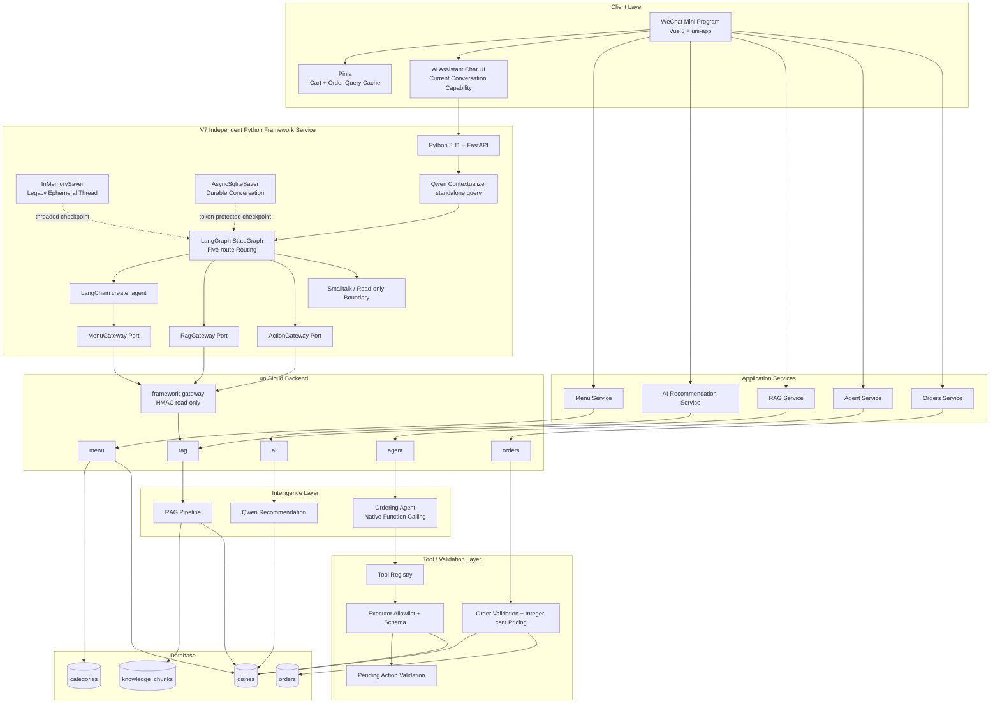
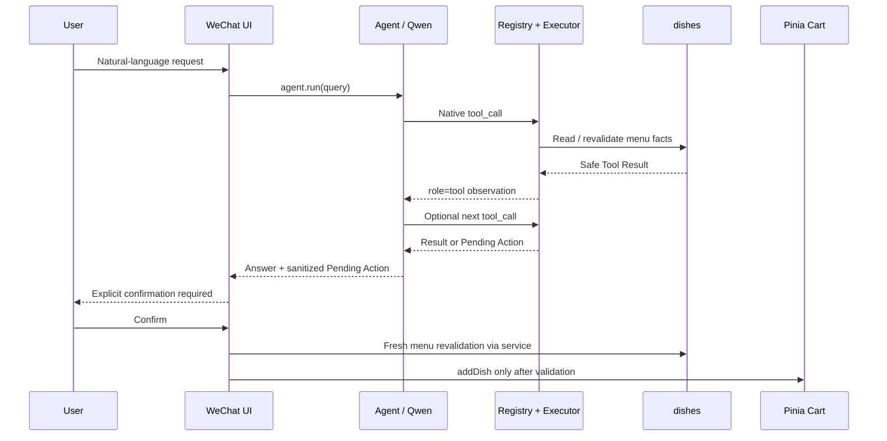
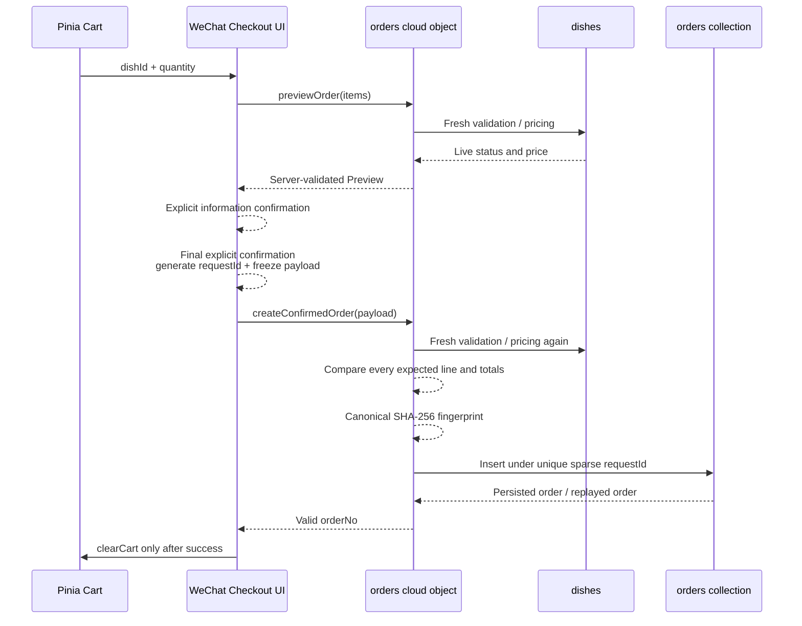

# 系统架构

## 1. 项目定位

这是一个基于 Vue 3、uni-app、Pinia 与 uniCloud 的微信智能点餐项目，包含三条相互独立但共享真实菜单事实的智能能力：

- Qwen 菜品推荐：自然语言偏好 → 真实菜品白名单。
- RAG 菜单问答：知识检索 → evidence 选择 → 服务器原文渲染。
- Ordering Agent：原生 Function Calling → 菜单 Tool → 待确认购物车动作。

RAG 与 Ordering Agent 当前没有互相作为 Tool 调用；LangGraph 只在顶层选择独立分支，
`rag.answer()` 没有注册为 Agent Tool。购物车和订单副作用也不由 LLM 直接执行。

V7.1A 在现有系统旁新增独立的 Python FastAPI + LangChain 框架服务。它通过
`MenuGateway` 端口隔离菜单来源，并使用测试 fixture 完成离线编排验证。V7.1B-2 的正式
`UniCloudHttpMenuGateway` 已完成真实 uniCloud 只读接入验收。V7.1C 又完成真实 Qwen、
LangChain `create_agent`、Structured Tools、Gateway 和真实菜单数据的端到端验收。V7.2A 已实现
显式自定义 LangGraph `StateGraph`：顶层图负责路由和
结果归一化，现有 LangChain Agent 继续负责菜单 Tool Loop。smalltalk、真实 Qwen 菜单查询和
只读拒绝均已通过本地 FastAPI 正式入口验收。V7.2B 新增 `knowledge_query → rag_node`，经
`RagGateway → HMAC Framework Gateway → rag_answer` 复用现有 uniCloud RAG；四条闭合路由
均已完成真实验收。V7.2C 再加入 `action_query → native_action_node`，经同一认证 Gateway 的
`agent_propose_action` 调用现有 Native Agent，并已完成真实 action proposal 与支付拒绝验收。
当前五条闭合路由为 `menu_query`、`knowledge_query`、`action_query`、`smalltalk` 和
`unsupported_action`。V7.3A 通过可选 `threadId`、进程内 `InMemorySaver` 和受限 Qwen
Contextualizer 增加短期多轮语义上下文；V7.3B 再以 `AsyncSqliteSaver`、单会话 capability token
和安全 History API 实现同一持久文件系统上的进程重启恢复。V7.3C 已将该链路接入微信聊天页，
并通过显式 UI 确认调用既有确定性购物车路径。该能力不改变交易职责边界。

V7.1B-1 已把 Native Agent 的三个只读菜单能力抽取到 uniCloud Shared Menu Domain，并让
Native Agent 与经过 HMAC-SHA256 认证的 URL 化 Framework Gateway 复用同一实现。Shared
Domain、Gateway 和真实 uniCloud 菜单读取均已完成云端验收。V7.1B-2 已在 Python 服务中
实现 `UniCloudHttpMenuGateway`，并通过正式 HMAC/HTTPS 路径完成三个只读操作的真实云端
验收。自动测试继续使用 `InMemoryMenuGateway` 或 `httpx.MockTransport`，不会访问远程服务。

## 2. 分层架构


```mermaid
graph TB
  subgraph Client[Client Layer]
    WX[WeChat Mini Program<br/>Vue 3 + uni-app]
    CHAT[AI Assistant Chat UI<br/>Current Conversation Capability]
    PINIA[Pinia<br/>Cart + Order Query Cache]
  end

  subgraph Services[Application Services]
    MS[Menu Service]
    AIS[AI Recommendation Service]
    RS[RAG Service]
    AS[Agent Service]
    OS[Orders Service]
  end

  subgraph Intelligence[Intelligence Layer]
    REC[Qwen Recommendation]
    RAG[RAG Pipeline]
    AG[Ordering Agent<br/>Native Function Calling]
  end

  subgraph FrameworkService[V7 Independent Python Framework Service]
    FASTAPI[Python 3.11 + FastAPI]
    MEM[InMemorySaver<br/>Legacy Ephemeral Thread]
    DUR[AsyncSqliteSaver<br/>Durable Conversation]
    CTX[Qwen Contextualizer<br/>standalone query]
    LG[LangGraph StateGraph<br/>Five-route Routing]
    LC[LangChain create_agent]
    GW[MenuGateway Port]
    RGW[RagGateway Port]
    AGW[ActionGateway Port]
    SMALL[Smalltalk / Read-only Boundary]
    FASTAPI --> CTX --> LG
    MEM -. threaded checkpoint .-> LG
    DUR -. token-protected checkpoint .-> LG
    LG --> LC --> GW
    LG --> RGW
    LG --> AGW
    LG --> SMALL
  end

  subgraph Validation[Tool / Validation Layer]
    REG[Tool Registry]
    EXE[Executor Allowlist + Schema]
    ACT[Pending Action Validation]
    PRICE[Order Validation + Integer-cent Pricing]
  end

  subgraph Cloud[uniCloud Backend]
    MENU[menu]
    AI[ai]
    RAGOBJ[rag]
    AGOBJ[agent]
    ORD[orders]
    FGW[framework-gateway<br/>HMAC read-only]
  end

  subgraph DB[Database]
    C[(categories)]
    D[(dishes)]
    K[(knowledge_chunks)]
    O[(orders)]
  end

  WX --> PINIA
  WX --> CHAT --> FASTAPI
  WX --> MS
  WX --> AIS
  WX --> RS
  WX --> AS
  WX --> OS
  MS --> MENU
  AIS --> AI
  RS --> RAGOBJ
  AS --> AGOBJ
  OS --> ORD
  GW --> FGW
  RGW --> FGW
  AGW --> FGW
  FGW --> RAGOBJ

  AI --> REC
  RAGOBJ --> RAG
  AGOBJ --> AG
  AG --> REG --> EXE --> ACT
  ORD --> PRICE

  MENU --> C
  MENU --> D
  REC --> D
  RAG --> K
  RAG --> D
  EXE --> D
  PRICE --> D
  PRICE --> O
```

当前附加的真实只读边界为：

```text
Native Agent ───────────────┐
                            ├─ Shared Menu Domain ── Real uniCloud DB
Framework Gateway ─────────┘

Python LangChain Service ── MenuGateway ── UniCloudHttpMenuGateway
        └──────────────────── HTTPS + HMAC ── Framework Gateway

Python LangGraph rag_node ── RagGateway ── same authenticated HTTP adapter
        └──────────────────── rag_answer ── existing uniCloud rag.answer(query)

Python LangGraph native_action_node ── ActionGateway ── same authenticated HTTP adapter
        └──────────────────── agent_propose_action ── existing Native Agent proposal
```

Python Adapter 与协议已完成真实 Gateway 验收。V7.1C 进一步通过本地受控验收脚本调用真实
Qwen：`search_menu` 返回空结果后，模型在下一次决策调用 `list_available_drinks`，形成
`call → result → call → result`。这证明该案例中的 Tool-result-driven sequential replanning，
不代表所有请求都具有通用自治规划保证。

### Client Layer

- 页面只展示经过 service 清洗的数据。
- Pinia Cart 是客户端购物车状态；订单 Store 只缓存云端查询结果。
- 首页提供 AI 推荐、菜单问答与 Ordering Agent 三个独立入口。
- TabBar 保持首页、菜单、购物车、订单、我的五项。

### Application Services

`src/services/` 集中处理云对象调用、输入校验、响应白名单和友好错误：

- `menu.js`：分类与菜品。
- `ai.js`：自然语言菜品推荐。
- `rag.js`：正式单轮 `rag.answer(query)`。
- `agent.js`：正式 `agent.run(query)` 与前端动作确认复核。
- `orders.js`：Preview、Confirmed Create、requestId 与结果未知重试状态所需结构。

### Intelligence Layer

- Recommendation 使用 Qwen3.8-Flash 选择真实菜品 ID。
- RAG 使用 qwen3.7-text-embedding-flash/512 做检索，再由 Qwen3.8-Flash 选择 evidence ID。
- Agent 使用 Qwen3.8-Flash 原生 Function Calling，允许有限多步 Tool Loop。

### Tool / Validation Layer

- Registry 是 Agent 唯一机器可读 Tool 定义源。
- Executor 使用静态实现映射、allowlist、参数 Schema 与 `additionalProperties=false`。
- Action Tool 只生成 Pending Action，不修改购物车。
- Orders 使用实时数据库事实、整数分计价、Expected Preview 比较和幂等校验。

### uniCloud 与数据库

| Collection | 职责 |
| --- | --- |
| categories | 菜单分类及排序 |
| dishes | 菜名、介绍、配料、实时价格、销量、辣度和在售状态 |
| knowledge_chunks | 已验证知识的派生向量索引，不是人工 Source of Truth |
| orders | 订单快照、状态、匿名 clientId，以及 confirmed 路径的幂等字段 |

数据库客户端直连权限关闭，业务访问通过云对象完成。

## 3. 传统菜单与订单

```text
Menu Page
 → menu service
 → menu cloud object
 → categories / dishes

Order List Page
 → orders service / Pinia query cache
 → orders cloud object
 → orders by clientId
```

clientId 只是开发期匿名隔离标记，不能作为身份认证或授权。

## 4. Qwen Recommendation

```text
Natural-language preference
 → ai.recommend(message)
 → read on_sale dishes
 → Qwen chooses 1–3 dishIds
 → server validates IDs and status
 → server rereads live price
 → server calculates totalPrice
 → frontend cards / existing Pinia addDish
```

模型返回的价格、名称或状态都不成为业务事实；最终字段来自数据库。

## 5. RAG Pipeline

### 5.1 Knowledge 与 Indexing

```text
docs/rag/knowledge-source.json
 → deployment resource sync check
 → verified-only validation
 → batch Embedding
 → contentHash / sourceVersion / model / dimension comparison
 → insert, update or skip knowledge_chunks
```

- 21条人工审核知识，类型为 description、taste、ingredients。
- Embedding 模型为 qwen3.7-text-embedding-flash，维度512。
- knowledgeId 唯一；相同版本、hash、模型和维度直接 skip。
- Source 不再存在的 orphan 只报告，不自动删除。

### 5.2 Retrieval

```text
Query
 → Query Embedding
 → read 21 compatible verified chunks
 → Exact Cosine Similarity
 → deterministic sort
 → Top-3
```

当前规模只有21条，因此 Exact Search 简单、可解释、易测。没有 ANN、HNSW 或外部 Vector DB，也没有 threshold、BM25、reranker 或 type boost。

### 5.3 Evidence-first Generation

```text
Top-3 Knowledge + Live Dish Facts
 → Qwen selects answerable / dishIds / usedKnowledgeIds
 → server validates selected IDs and relationships
 → server rereads live dishes
 → server renders answer from trusted evidence.text
```

该设计来自真实 Grounding 失败：模型曾加入“解腻”，也曾把“柠檬香气”扩写为“清爽的柠檬香气”。最终模型不再生成事实句，事实文本由服务器从 evidence 原文确定性渲染。

它阻止模型改写事实直接进入答案，但仍不能保证模型一定选全、选对 evidence。

## 6. Ordering Agent

### 6.1 Agent Action Flow


```mermaid
sequenceDiagram
  participant U as User
  participant UI as WeChat UI
  participant A as Agent / Qwen
  participant X as Registry + Executor
  participant DB as dishes
  participant C as Pinia Cart

  U->>UI: Natural-language request
  UI->>A: agent.run(query)
  A->>X: Native tool_call
  X->>DB: Read / revalidate menu facts
  DB-->>X: Safe Tool Result
  X-->>A: role=tool observation
  A->>X: Optional next tool_call
  X-->>A: Result or Pending Action
  A-->>UI: Answer + sanitized Pending Action
  UI-->>U: Explicit confirmation required
  U->>UI: Confirm
  UI->>DB: Fresh menu revalidation via service
  UI->>C: addDish only after validation
```

### 6.2 Tool Contracts

| Tool | 类型 | 副作用 |
| --- | --- | --- |
| search_menu | Read | 无 |
| list_available_drinks | Read | 无 |
| get_dish_detail | Read | 无 |
| prepare_add_to_cart | Action Preparation | 只返回 Pending Action |

真实“可乐”案例中，第二次 `list_available_drinks` 是 Qwen 观察 `search_menu` 空结果后的 re-planning，不是代码写死 fallback。

### 6.3 Action Safety

`prepare_add_to_cart` 只接受 dishId 与1～20整数 quantity。服务器重新读取 status 与 price，生成 `requiresConfirmation=true` 的提案。微信 UI 确认时再次读取菜单；不存在、售罄或价格变化都会让旧提案失效。

LLM 不持有任意 Store 引用，不接受动态实现路径，也不能绕过 Executor 直接修改 Cart。
Native Agent Registry 只包含上述三个只读菜单 Tool 与 proposal-only 的
`prepare_add_to_cart`，不包含 `createConfirmedOrder`、payment 或 confirmed transaction
execution。V7.2C 的 `native_action_node` 只根据已验证 `pendingAction` 确定性渲染用户提示；
真实支付请求进入 `unsupported_action`，不会产生 proposal。

离线无副作用测试实际运行现有 Native Runner，并让 DB fixture 的 `add`、`update`、`remove`
一旦被调用就立即失败。测试只观察到 dishes read，没有 cart mutation、order insert、
confirmed execution 或 executed flag。

## 7. Order Transaction Flow


```mermaid
sequenceDiagram
  participant C as Pinia Cart
  participant UI as WeChat Checkout UI
  participant O as orders cloud object
  participant D as dishes
  participant DB as orders collection

  C->>UI: dishId + quantity
  UI->>O: previewOrder(items)
  O->>D: Fresh validation / pricing
  D-->>O: Live status and price
  O-->>UI: Server-validated Preview
  UI-->>UI: Explicit information confirmation
  UI-->>UI: Final explicit confirmation<br/>generate requestId + freeze payload
  UI->>O: createConfirmedOrder(payload)
  O->>D: Fresh validation / pricing again
  O-->>O: Compare every expected line and totals
  O-->>O: Canonical SHA-256 fingerprint
  O->>DB: Insert under unique sparse requestId
  DB-->>O: Persisted order / replayed order
  O-->>UI: Valid orderNo
  UI->>C: clearCart only after success
```

### 7.1 确认值比较

Create 不只比较总价，还逐项比较 dishId、quantity、unitPrice、lineTotal、totalQuantity 与 totalPrice。这样即使两个菜品一涨一降、总价碰巧不变，仍能识别旧 Preview。

明确业务失败包括：

- `ORDER_CONFIRMATION_STALE`
- `ORDER_DISH_UNAVAILABLE`
- `ORDER_DISH_NOT_FOUND`
- `ORDER_ITEMS_INVALID`
- `ORDER_IDEMPOTENCY_CONFLICT`
- `ORDER_REQUEST_ID_INVALID`

这些错误保留 Cart，但清除旧 Proposal、确认状态、requestId 和 frozen payload。

### 7.2 Outcome Unknown

网络或 timeout 可能发生在服务端写入之后。页面不会声称“订单未创建”，而是保留 Cart、Proposal、requestId 与 frozen payload，显示“重试确认下单”。重试不重新读取已经可能变化的 Cart，而是复用同一提交内容。

### 7.3 Idempotency

```text
requestId
 + canonical(clientId, items, expectedPreview, remark)
 → SHA-256 requestFingerprint
 → request_id_unique (unique=true, sparse=true)
```

- Same key + same fingerprint：返回首次持久化订单。
- Same key + different fingerprint/clientId：`ORDER_IDEMPOTENCY_CONFLICT`。
- check-then-insert 只能优化普通重试；并发唯一性最终由数据库 UNIQUE index 保证。

## 8. V7.3A Multi-turn Context

```text
POST /v1/agent/run { query, threadId? }
 → load same-process thread state when threadId exists
 → contextualize ambiguous follow-up
 → resolved_query
 → existing five-route graph
 → normalize_result
 → retain bounded HumanMessage / final AIMessage history
 → checkpoint
```

`threadId` 是可选的 conversation correlation identifier，trim 后必须匹配
`[A-Za-z0-9_-]{8,128}`；它不是身份、认证、授权或交易凭证。无 `threadId` 请求走独立的无状态
图，不共享默认线程。`FrameworkGraphState.query` 保留用户原始输入，`resolved_query` 是内部
standalone query，正式 API 只返回前者。

LangGraph 1.2.12 通过 `StateGraph.compile(checkpointer=...)` 接入 `InMemorySaver`，实例保存在
FastAPI `app.state`，只在当前 Python 进程内有效。历史最多保留 8 条顶层 `HumanMessage` 与最终
`AIMessage`，不保存 ToolMessage、system prompt、reasoning、provider metadata、raw response、
HMAC 或 secret。进程重启会丢失状态。

真实验收测试 ID `chat_accept_03` 的连续请求覆盖菜单价格追问、RAG 口味追问和柠檬茶 ×2
proposal；随后“确认”仍进入安全边界，不执行购物车、订单或支付。新的验收测试 ID
`chat_accept_04` 从“多少钱？”开始时没有继承柠檬茶上下文，验证了 conversation state
isolation。无 `threadId` 的“你好”保持旧有单轮行为。Graph 更新可以显式清理旧
`pendingAction`；checkpoint 中的 proposal 不是执行授权。

首次真实 follow-up 全部返回 `FRAMEWORK_CONTEXT_FAILED`，原因是 Contextualizer 使用 forced
named `tool_choice` 且只接受单一 normalized Tool Call。修复后使用普通 `bind_tools`，服务器仍
严格校验 schema，并兼容 `normalized_tool_call`、`raw_openai_tool_call` 和
`strict_json_content`。本次真实 Qwen 单独验收走 `normalized_tool_call`；其他两条是兼容保护。

### 8.1 V7.3B Persistent Conversation

```text
POST /v1/conversations
 → server-generated threadId + one-time conversationToken
 → SHA-256 token digest registry

threadId + X-Conversation-Token
 → constant-time capability check
 → AsyncSqliteSaver
 → messages (最近 8 条模型上下文)
 → archiveMessages (最近 100 条安全历史)
 → 同一 checkpoint
```

`FRAMEWORK_CHECKPOINT_DB_PATH` 未配置时，原无状态请求与 V7.3A 自带 `threadId` 的进程内模式保持
兼容；持久会话接口 fail closed。配置后，FastAPI lifespan 负责打开、初始化和关闭 SQLite 连接。
History API 只投影 `user/assistant + content`，不暴露 ToolMessage、checkpoint、resolved query、
route、pending state、reasoning、provider metadata 或 secret。消息只有 LangGraph checkpoint 一个
事实源；独立 registry 只保存 threadId、token hash 与时间戳。

conversationToken 是单会话 capability，不是用户身份或交易授权。当前没有 expiry、rotation、
conversation list 或跨用户账户绑定；`pendingAction` 仍只是提案状态，“确认”仍不执行写操作。
SQLite 只在同一持久文件系统上提供进程重启恢复，不承诺容器临时文件系统、跨机器、多实例或
分布式并发一致性。真实验收已证明 Process 1 完全停止后，Process 2 能从同一 SQLite 文件恢复
柠檬茶语义上下文；动态价格仍重新进入实时菜单路径。History API 返回两轮安全消息，错误 token
统一返回 `FRAMEWORK_CONVERSATION_ACCESS_DENIED`。

### 8.2 V7.3C WeChat Conversation UI

```text
WeChat Chat UI
 → Framework Agent service
 → FastAPI durable conversation
 → Contextualizer + five-route LangGraph
 → safe answer / validated pendingAction

pendingAction
 → explicit UI confirmation
 → live uniCloud menu revalidation
 → existing Pinia addDish
```

真实微信开发者工具验收连续覆盖“有柠檬茶吗？”、“多少钱？”、“它是什么味道？”和“那来两杯。”：
菜单事实继续读取实时 Tool，知识追问继续复用现有 RAG，动作分支只返回柠檬茶 ×2、单价 12 元、
合计 24 元的已验证提案。页面没有展示 dishId、route、Tool 名称、raw JSON、reasoning、token 或
checkpoint 内部字段。

点击动作卡确认后，前端重新读取实时菜单并校验状态与价格，再调用既有 Pinia `addDish`；购物车
最终为柠檬茶 ×2、合计 ¥24。本次没有创建订单或支付。文字“确认”仍作为普通 Query，既没有
重复加购，也没有进入订单路径。CLI 直接运行小程序时缺少已关联的 uniCloud 运行环境，实时复核
安全失败且没有写 Cart；改用 HBuilderX 连接远程服务空间后复核和加购成功。

页面退出重进和 FastAPI 完全重启后均通过本地 capability 与同一 SQLite 文件恢复安全文字历史。
新对话创建新的 threadId/token，但不删除旧会话。History 不包含 `pendingAction`，动作卡是
session-local UI state。该验收不代表跨机器、多实例、跨设备账户同步或文本确认执行。

## 9. Evaluation 与测试

RAG 端到端评测使用21条知识与12条固定 Query：

- Answerability Accuracy：11/12，91.67%。
- Supported Answer Rate：5/6，83.33%。
- Unsupported-domain Rejection：3/3，100%。
- External-OOD Rejection：3/3，100%。
- Retrieval Hit Rate：6/6 supported，100%。
- Average Retrieval Recall@3：约80.83%。
- Evidence Hit Rate：5/6 supported，83.33%。
- Server Grounding Pass：12/12，100%。

这是项目级小样本评测，不是生产 Benchmark。V6 冻结时为747项自动化测试；V7.3C
当前完整回归为851项 JavaScript 测试与197项 Python 测试，并另有微信开发者工具、
真实 uniCloud 数据库、管理入口、URL 化 Gateway 与五条 LangGraph 路由验收记录。

## 10. 信任边界

| 输入或组件 | 信任方式 |
| --- | --- |
| LLM dishId / evidence ID | 白名单、当前上下文子集、数据库二次读取 |
| LLM 自由文本 | 不作为菜单价格、状态或最终 RAG 事实 |
| Tool name / arguments | Registry allowlist + JSON Schema + static mapping |
| Client price / total | 不信任；服务端重新计价 |
| Expected Preview | 仅作为用户确认预期，与服务端实时结果逐项比较 |
| requestId | 幂等键，不是授权、认证或 orderNo |
| clientId | 开发期隔离，不是正式身份认证 |

## 11. Current Scope / Future Work

- RAG 后端接口仍为单轮；Python LangGraph 可在顶层工作流中提供受限 conversation context。
- RAG 不是 LangChain Agent Tool；LangGraph 只在独立 `knowledge_query` 分支调用它。
- 21 chunks、12-query baseline，规模有限。
- Pinia Cart、Pending Action 与未决提交恢复不跨小程序重启持久化。
- 没有支付、库存事务、uni-id 或 exactly-once distributed transaction。
- 没有生产规模 Vector DB、ANN、分布式检索和生产治理。
- 已完成 `AsyncSqliteSaver`、capability token、安全 History API 和同一持久文件系统真实重启验收。
  没有跨机器/多实例保证、conversation list、账户级跨设备身份、token expiry/rotation/revocation、
  多轮文本确认执行或长期记忆。V7.3C 微信聊天 UI 已完成真实验收，旧动作卡不随 History 恢复。
- Framework Agent 生产接入仍要求 HTTPS 合法域名；本地开发者工具关闭域名校验不属于生产配置。

下一步应先扩充评测与失败样本，再基于冻结 baseline 比较检索、Evidence Selection 和持久化恢复方案，而不是直接扩大 Agent 权限。

## 12. 文档索引

- [RAG V4 Summary](rag/V4_SUMMARY.md)
- [RAG Answer Evaluation](rag/ANSWER_EVALUATION.md)
- [Agent Loop](agent/AGENT_LOOP.md)
- [Action Proposal](agent/ACTIONS.md)
- [User Confirmation](agent/CONFIRMATION.md)
- [Order Execution](agent/ORDER_EXECUTION.md)
- [Order Idempotency](agent/ORDER_IDEMPOTENCY.md)
- [Demo Guide](DEMO_GUIDE.md)
- [Final Summary](FINAL_SUMMARY.md)
